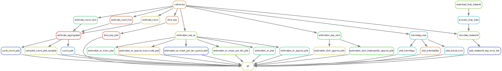

# Random Abstract Cell Complexes


[](https://arxiv.org/abs/2405.0000)
[](https://github.com/josefhoppe/random-abstract-cell-complexes/blob/main/LICENSE)
[![Snakemake 8.11.3](https://img.shields.io/badge/Snakemake-8.11.3-039475.svg?logo=data:image/png;base64,iVBORw0KGgoAAAANSUhEUgAAABkAAAAZCAYAAADE6YVjAAABhGlDQ1BJQ0MgcHJvZmlsZQAAKJF9kT1Iw0AcxV9TRSlVh3aQ4hCwOlkQFXHUKhShQqkVWnUwufQLmjQkKS6OgmvBwY/FqoOLs64OroIg+AHi6uKk6CIl/i8ptIjx4Lgf7+497t4BQqPCVLNrHFA1y0gn4mI2tyr2vCKACPoRwrDETH0ulUrCc3zdw8fXuxjP8j735+hT8iYDfCLxLNMNi3iDeHrT0jnvE4dZSVKIz4nHDLog8SPXZZffOBcdFnhm2Mik54nDxGKxg+UOZiVDJZ4ijiqqRvlC1mWF8xZntVJjrXvyFwbz2soy12kOIYFFLCEFETJqKKMCCzFaNVJMpGk/7uGPOP4UuWRylcHIsYAqVEiOH/wPfndrFiYn3KRgHOh+se2PEaBnF2jWbfv72LabJ4D/GbjS2v5qA5j5JL3e1qJHwMA2cHHd1uQ94HIHGHzSJUNyJD9NoVAA3s/om3JA6BYIrLm9tfZx+gBkqKvkDXBwCIwWKXvd4929nb39e6bV3w91xnKo0GhamgAAAAZiS0dEAA4ADgAOq1UFEwAAAAlwSFlzAAAWJQAAFiUBSVIk8AAAAAd0SU1FB+cKGwwkI1CoIBUAAAKYSURBVEjHtZZPSFRxEMc/897z76oXrUNQYUVBXoIINimiQ0T/IAo6JAQhZeiTKHrmJehW7IoQ7m4aHSoIO5h1qoOBhlGJ0SUjiqggAskizQxc33vTwbexrouYu83tzczv953fzHdmnpAhZsypBU4C24FVgBmYhOyiQBJ4Dwwg0uU1RV6lO0ja5WVAJ3B0gQsXIz5wBeW81xydIRWllXBCKI+AvUsBuLx+C90H6qmYnKT/x6gAWxE2yJ5wrz58pgaA+nQA4aWGXl5UQkVpiFBhSbr6iIh5FkDMmLMZGM4xRVQXFPFxZjpTPQVSbQANuQIA2QAAQojWGMBO/p+8BBm2gDVZjCNAAhhCdGqWp8aCDxY80v0EdU1xPyQb29XKcrI9oJ9rdThlqlI+e4kGLZENwPjlNrdNZuq9lN2MOZ+A1cF3t6FS54tuBK4C2/6hXqNAHxD37OjQnCDMmHMTOAbMIFINJFEdAZYvsQ4KXMOwTnuNl6YBDOB6YHzhNUW+oHo8B4DUFGnAd3usWIsJYHh2dBDoBT4HTuvyxKz9iramXoIg9QGjAN7lkcKtZtyplPlT+FwVyOscU5Yup4x5tLPbvgUNOhBM1FyldkF6FnQ6hSZanHWeq2H4vpiiWuCjVcAO4AywNsP1iQCY8ZYQqisXxRyR2SWm6qYpv7t2ZMxMOKX43AIOp50ZFDPu1KA8BipzSIkCD4B6DMbxeQ5sCmw3DJSDOQKkemMfcF+UJHAxPV0W8DSPlA0rhBHpQ9UDfgrSY3h2tB+4mzcYZYXXFPkNjAMXXDsykaLwCeBNnmBSzdxFMYk5fytWzFmmcBvYlQPAPc+OHspU/m1G146OgewOCngHeAtMAG6WRZJaLh4wA3wFOhCjLhvyH6jS1OKPekJ4AAAAAElFTkSuQmCC)](https://snakemake.readthedocs.io)

## About

This repository contains the evaluation workflow for the paper *Random Abstract Cell Complexes*.
You can find the accompanying Python package at [PyRaCCooN](https://github.com/josefhoppe/py-raccoon).
If you use this code, please cite our paper:

```

```

## Running numerical experiments

This project uses [Snakemake](https://snakemake.readthedocs.io).
To run the experiments:

1. Install [Miniconda](https://docs.conda.io/en/latest/miniconda.html) (or mamba)
2. Create a new conda environment and install dependencies: `conda env create -n rcc -f workflow/envs/environment.yaml`
3. Activate environment: `conda activate rcc`
4. Run snakemake: `snakemake -c100 all`

For us, running all experiments takes about 2 hours (or around 23 core-hours).
You can also build individual artifacts instead, for example `snakemake -c20 figures/homology.pdf`.

## Workflow structure

The Rulegraph gives a rough overview of the structure:



There are five main experiments:

- **estimate_count**: Estimates the cycle count (parallelized for efficiency; `estimate_aggregated` aggregates again).
- **time_exp**: Runtime experiment.
- **estimation_exp_{er,sbm}**: Estimates the occurrence probability (for different settings)
- **homology_exp**: Analyzes the properties of generated CCs.
- **simulate_realworld**: Adapted from [1] to showcase the usage of RCC as a baseline.

## References

- [1]: Hoppe, Josef, and Michael T. Schaub. "Representing Edge Flows on Graphs via Sparse Cell Complexes." Learning on Graphs Conference. PMLR, 2024.

## Acknowledgements

Funded by the European Union (ERC, HIGH-HOPeS, 101039827). Views and opinions expressed are however those of the author(s) only and do not necessarily reflect those of the European Union or the European Research Council Executive Agency. Neither the European Union nor the granting authority can be held responsible for them.
